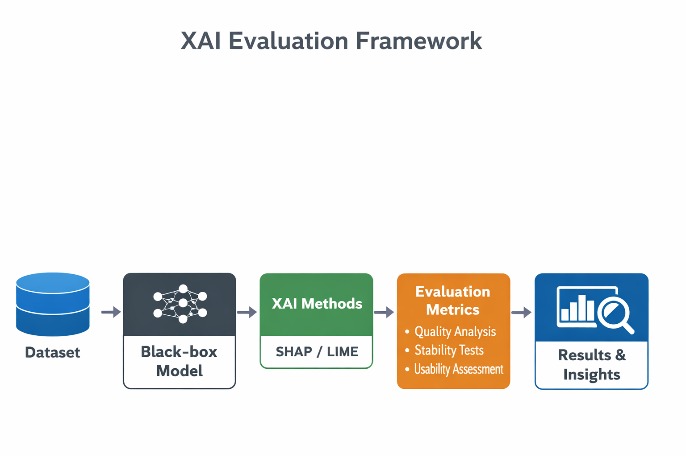

⚠️ Note: OmniXAI is used as the base explainability engine.
The core contribution of this project lies in the evaluation framework
implemented under the custom modules for quality, stability, and usability.

# XAI Evaluation Framework (Extension of OmniXAI)

This repository is based on the OmniXAI library developed by Salesforce.
The original OmniXAI codebase is used without modification.

## Project Contribution

The directory `xai_evaluation_framework/` contains the original contribution of this project,
which proposes a unified framework to evaluate the quality, stability, and usability of
Explainable AI (XAI) methods such as SHAP and LIME.

## Features

- Black-box model training (Random Forest)
- Explanation generation using OmniXAI (SHAP, LIME)
- Stability analysis using input perturbation
- Quality and usability evaluation metrics
- Visualization of evaluation results

## How to Run

```bash
pip install -r requirements.txt
python xai_evaluation_framework/run_experiments.py

## Project Architecture

```
